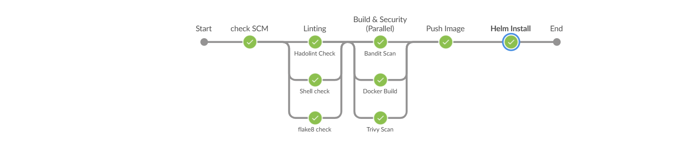

# docker-k8s-depploy-myapp
depploy a python app with dockerfile &amp; k8s

##  Prerequisites
* docker Docker version 29.2.0 v 
* Kubernetes version 1.34.1 v
* helm 3.0 v
  
## Architecture
This project creates:
* create an iamge
*  deploy iamge with a docker file
* deploy en iamge with helm chart

## The Process

I started by gettin the  code for the dev team (pyhon code) & the requirements for the code throw a requirements.txt .

the next step was to create the docker by filling the details of the iamge {EXPOSE port & run command ...) .

I create the docker file I run the command to deploy it and check the iamge and the code that it working as it should be before I upload it to docker hub . 

then I upload it to docker hub .

after the iamge was upload to docker hub I can use it in a helm file to deploy it but before that I need to build the yamls.

to buid the helm i need to fill the yamls such as deplyment.yaml , ingress.yaml , service.yaml , values.yaml .  

Finally, after the settup is commpit i run the deployment on a localhost at prot 8000 and check the it one last time .

Along the way, while building everything, I took notes on what I've learned the deffrent bettwin helm and docker file 
. I also documented the behind-the-scenes processes every time a feature was added.

This way, I understood what I've built. The funny thing is, as soon as I started to document what happened behind the scenes and the features I've added, it made me realize that we fully understand something once we've actually taken a step back, thought about it, and documented what we've done. I think this is a good practice to follow when learning something new.

##  Running the Project with a docker file 

To run the project in your local environment, follow these steps:

### * make sure you are standing inside the folder * 
### make usre the k8s is up and running 
  
1. Clone the repository to your local machine with the command `git clone `. 
2. Run `docker build -t <name:tage> . ` swap the "<name:tag>" in to your iamge name
3. now we need to the the container run the command `docker run -dit -p 80:8000 <name:tage> --name <name>`
4. open the brother and tape in the url `localhost:8000` to open the the app

##  Running the Project with a helm chart

### * make sure you are standing inside the folder *
### make usre the k8s is up and running 

To run the project in your local environment, follow these steps:
1. Clone the repository to your local machine with the command `git clone `. 
2. Run `helm install <name> ./chart  ` swap the "<name>" in to your any name you want to
3. now we need to open the port to talk to the app by the command `kubectl port-forward service/<name>-svc 8000:80`
4. open the brother and tape in the url `localhost:8000` to open the the app

   ###
   

how the pipeline look

